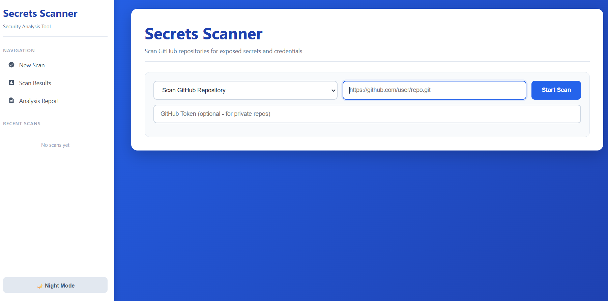
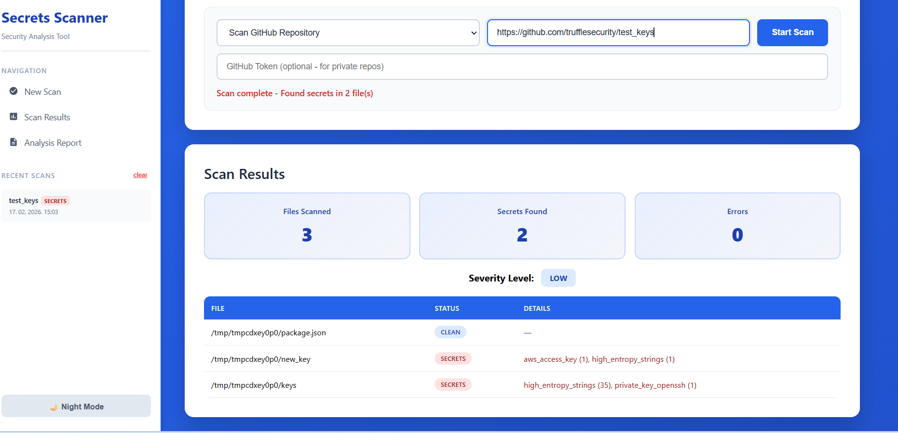
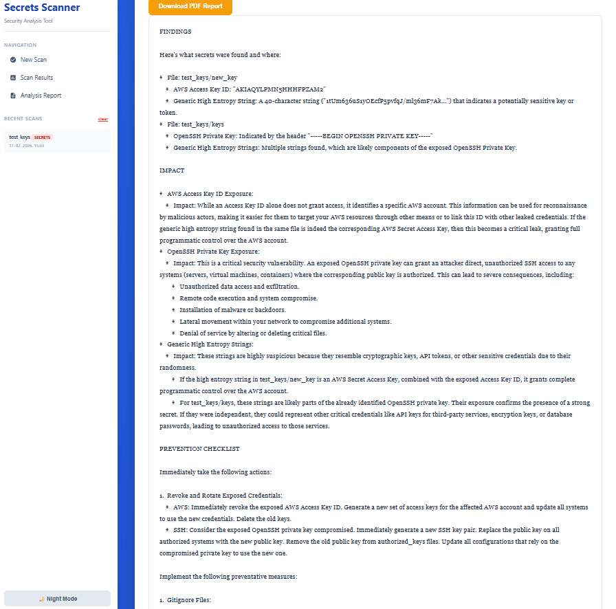

# 🔒 Secrets Scanner with LLM Analysis

A web-based tool for detecting exposed credentials and API keys in GitHub repositories, with AI-powered security reports.

Built on top of an open-source secrets scanner, extended with a web UI, LLM integration, and private repository support.

---

## What I Built

**Starting point:** A CLI secrets scanner with regex + entropy detection

**What I added:**
- Web interface for scanning repositories (paste URL, click scan)
- LLM-powered security reports via Google Gemini API
- Private repository support via GitHub token authentication
- Scan history (localStorage)
- PDF export of reports
- Severity badges (Critical / High / Medium / Low)
- Better error messages (404 / 403 / 401 specific feedback)

**Adaptive prompting:** The LLM prompt changes based on findings:
- 0 secrets → focus on best practices and borderline cases
- 1–10 secrets → detailed breakdown per finding
- 10+ secrets → priority triage (most critical first)

---

## Tech Stack

| Layer | Tech |
|-------|------|
| Backend | Python, Flask |
| Frontend | Vanilla JavaScript, HTML/CSS |
| AI | Google Gemini API (gemini-2.0-flash) |
| Deployment | Docker, Docker Compose |
| Auth | GitHub token injection |

---

## Quick Start

### 1. Clone the repo
```bash
git clone https://github.com/YOUR_USERNAME/secrets-scanner.git
cd secrets-scanner
```

### 2. Set up your API key
```bash
cp orchestrator/.env.example orchestrator/.env
```

Edit `orchestrator/.env` and add your Gemini API key:
```
GEMINI_API_KEY=your_key_here
```

Get a free key at: https://aistudio.google.com/apikey

### 3. Run
```bash
docker-compose up --build
```

Open: http://localhost:8000

---

## Testing

### Public repository
```
https://github.com/trufflesecurity/test_keys
```

### Private repository
1. Get a GitHub token: https://github.com/settings/tokens
2. Select scope: `repo`
3. Paste token in the UI when scanning

### Local directory
Place a repo in `./test-repos/` and scan using path `/repos/your-folder`

---

## Trade-offs & Decisions

**Why Gemini over OpenAI?**
Gemini has a free tier (15 req/min) — no cost for evaluation or testing.

**Why localStorage over a database?**
This is a single-user developer tool. localStorage keeps things simple without adding a database container. For multi-user production use, PostgreSQL would make sense.

**Why client-side PDF export?**
No server dependencies needed (WeasyPrint, wkhtmltopdf, etc.). Works offline. The 200KB jsPDF overhead is acceptable for this use case.

---

## What I'd Improve With More Time

- **Show exact lines:** Right now it says "secret in config.py". Would show line number + surrounding code for faster debugging.
- **More export formats:** JSON (for CI/CD pipelines), CSV (for spreadsheets), Markdown (for GitHub issues).
- **Support other platforms:** GitLab and Bitbucket use different auth but same concept.
- **Smarter detection:** ML layer to complement regex/entropy — detect base64-encoded secrets, reduce false positives.

---

## Architecture

```
Browser
  └── orchestrator (port 8000) ← Flask + static UI
        └── scanner (port 8001) ← REST API, regex + entropy detection
```

Scanner uses multiprocessing to scan files in parallel. Orchestrator clones repos, calls scanner, then generates LLM report.

---

## Security Note

Never commit your `.env` file. This repo includes `.env` in `.gitignore` and provides `.env.example` with placeholder values. Use `git archive` for clean submissions/exports:

```bash
git archive --format=zip --output=submission.zip HEAD
```

## Initial Page
*Initial page of the application*


## Start Scan
*Page for starting the scan*


## AI Report
*Results generated by the LLM / AI report*

